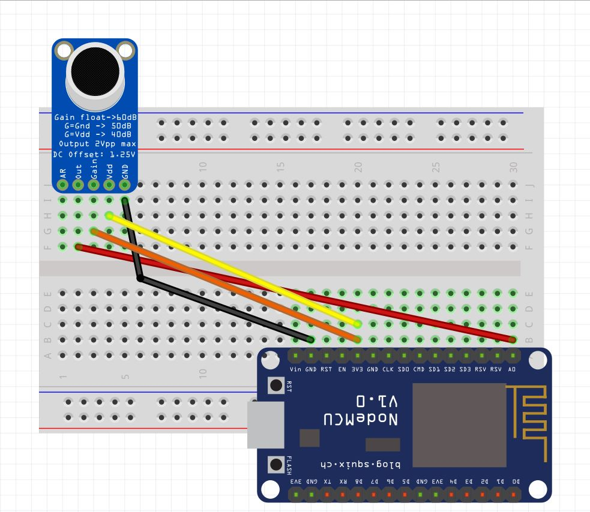
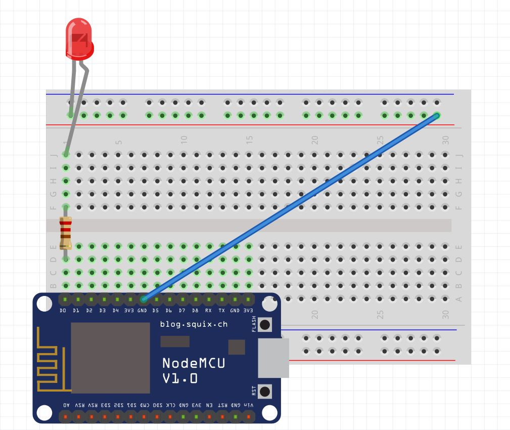

# posttest3-praktikum-iot-unmul
<ul>
<li>Indro Dwi Saputro 2009106099
<li>Yusuf Adi Iswanto 2009106148
<li>Asyhab Ramadhan 2009106145
</ul>

# Smart Home Monitoring dan Controlling Lampu
Menyalakan, Mematikan dan melihat status lampu
Alat yang digunakan untuk menyalakan dan mematikan lampu adalah sensor suara sebagai I/O
Monitoring dengan bot telegram, menyediakan perintah LEDON, LEDOFF, LEDSTATUS.
MQTT sebagai teknologi IOT dan broker hivemq sebagai server untuk mengirimkan dan menerima data antar perangkat.

# Komponen Yang Digunakan
## Publisher
<ul>
<li>NodeMCU
<li>BreadBoard
<li>Sensor Suara
<li>Kabel Jumper
</ul>
## Subscriber
<ul>
<li>NodeMCU
<li>BreadBoard
<li>LED
 <li>Resistor
<li>Kabel Jumper
</ul>

# Board Schematic
## Publisher

## Subscriber

